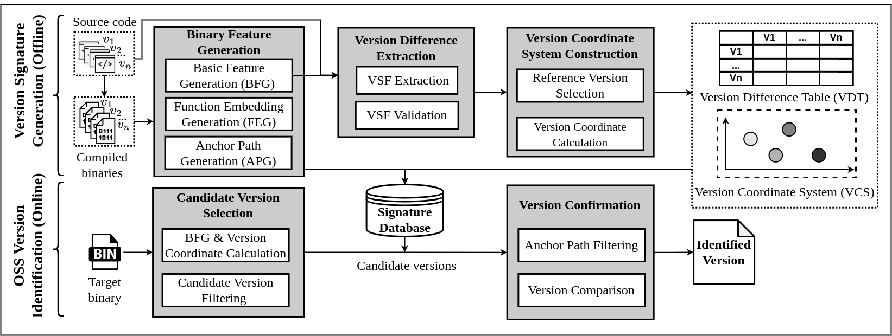
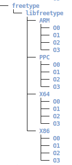

# LibvDiff
LibvDiff is a precise and efficient open-source software (OSS) version identification tool. It is designed to identify OSS versions in a fine-grained level, even though no version strings are available in the target binary. The workflow of LibvDiff is as follows:



## Requirements
Before using LibvDiff, please make sure you have installed the following environments:
- IDA Pro 7.5 +: We utilize IDA Pro to extract necessary features from the binaries, it is mainly designed for linux, but can be easily applied to windows with simple adjustment.  
  - Make sure the IDA Python switches to python3.
  - Extra python packages are required to install for IDA Python: `pip install cptools tqdm networkx==2.1.0 --target="/path/to/IDA Python/DIR/"`
- conda: We strongly suggest to utilize conda to build a new python environment.

## Installation
1. Create a new python environment with conda and activate it
```shell
conda create --name libvdiff python=3.8
conda activate libvdiff
```
2. Install pytorch with cuda (if GPU is available on your PC)
```shell
conda install pytorch==1.12.1 torchvision==0.13.1 torchaudio==0.12.1 -c pytorch
```
3. Install other required packages
```shell
pip install -r requirements.txt
```

## Configuration
Before you start, please read `data_process/settings.py` and change the `IDA_PATH, IDA64_PATH` with your own ida path.

## How to use

### Version Signature Generation 
Please follow the guide in [feature generation](data_process/README.md) 

### OSS Version Identification
```shell
python libvdiff.py --help
usage: libvdiff.py [-h] [-o OSS] [-c] [-a] [-e EXP]

optional arguments:
  -h, --help         show this help message and exit
  -o OSS, --oss OSS  specify OSS to test
  -c, --cvf          Turn on cvf
  -a, --apf          Turn on apf
  -e EXP, --exp EXP  Experiment (co: cross optimization, ca: cross architecture, cb: cross both)
```

- Output
```shell
python libvdiff.py -o freetype --cvf --apf -e co
load model from /root/largefiles/LibvDiff-public/saved/models/Asteria/crossarch_train_100000_1659022264.018625.pt, device is cuda:0
oss:freetype, lib: libfreetype, cvf: True, apf: True, exp:cross_optim
identify VER-2-8-1-ARM-O0 is VER-2-8-1-ARM-O1, 0.850: 100%|███████████████████████████████████████████████████████████████████████████████████| 20/20 [00:00<00:00, 21.88it/s]
identify VER-2-8-1-ARM-O0 is VER-2-8-1-ARM-O2, 0.850: 100%|███████████████████████████████████████████████████████████████████████████████████| 20/20 [00:01<00:00, 11.17it/s]
identify VER-2-8-1-ARM-O0 is VER-2-8-1-ARM-O3, 0.817: 100%|███████████████████████████████████████████████████████████████████████████████████| 20/20 [00:01<00:00, 19.59it/s]
identify VER-2-8-1-ARM-O1 is VER-2-8-1-ARM-O0, 0.825: 100%|███████████████████████████████████████████████████████████████████████████████████| 20/20 [00:01<00:00, 11.93it/s]
identify VER-2-8-1-ARM-O1 is VER-2-8-1-ARM-O2, 0.840: 100%|███████████████████████████████████████████████████████████████████████████████████| 20/20 [00:01<00:00, 13.00it/s]
identify VER-2-8-1-ARM-O1 is VER-2-8-1-ARM-O3, 0.825: 100%|███████████████████████████████████████████████████████████████████████████████████| 20/20 [00:01<00:00, 14.27it/s]
identify VER-2-8-1-ARM-O2 is VER-2-8-1-ARM-O0, 0.814: 100%|███████████████████████████████████████████████████████████████████████████████████| 20/20 [00:01<00:00, 11.32it/s]
identify VER-2-8-1-ARM-O2 is VER-2-8-1-ARM-O1, 0.825: 100%|███████████████████████████████████████████████████████████████████████████████████| 20/20 [00:01<00:00, 19.50it/s]
identify VER-2-8-1-ARM-O2 is VER-2-8-1-ARM-O3, 0.833: 100%|███████████████████████████████████████████████████████████████████████████████████| 20/20 [00:01<00:00, 19.04it/s]
identify VER-2-8-1-ARM-O3 is VER-2-8-1-ARM-O0, 0.830: 100%|███████████████████████████████████████████████████████████████████████████████████| 20/20 [00:01<00:00, 11.21it/s]
identify VER-2-8-1-ARM-O3 is VER-2-8-1-ARM-O1, 0.823: 100%|███████████████████████████████████████████████████████████████████████████████████| 20/20 [00:01<00:00, 12.96it/s]
identify VER-2-8-1-ARM-O3 is VER-2-8-1-ARM-O2, 0.825: 100%|███████████████████████████████████████████████████████████████████████████████████| 20/20 [00:01<00:00, 14.33it/s]
finished
```
- The result will be saved at `saved/libvdiff_idf_all_res`

## Dataset
The massive compiled OSS binaries can be downloaded from [google drive](https://drive.google.com/file/d/14g5fDqO1sW9WzxWOV2xvT2XFp90XIk97/view?usp=share_link). More details about the composition of dataset can be found in paper. The data structure is organized as `OSS/Lib/architecture/optimization/version/binary`, 



After downloading the dataset, decompress the data and save the data in the `dataset-public` directory to `data_process/dataset`

  
